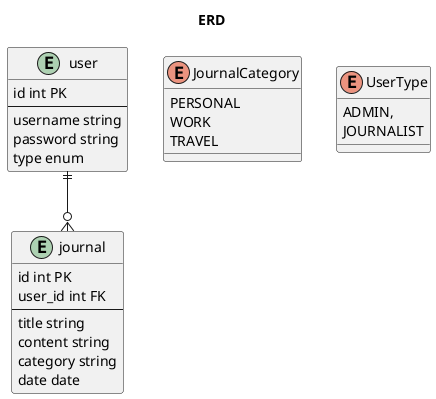

```plantuml
@startuml

title ERD

entity "journal" as journal {
  id int PK
  user_id int FK
  ---
  title string
  content string
  category string
  date date
}

enum "JournalCategory" as jt {
  PERSONAL
  WORK
  TRAVEL
}

enum "UserType" as ut {
  ADMIN,
  JOURNALIST
}

entity "user" as user {
  id int PK
  ---
  username string
  password string
  type enum
}

user ||--o{ journal
@endum

```