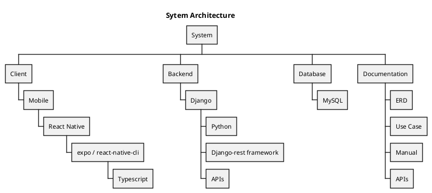

```plantuml
@startwbs

title Sytem Architecture

* System
** Client
*** Mobile
**** React Native
***** expo / react-native-cli
****** Typescript
** Backend
*** Django
**** Python
**** Django-rest framework
**** APIs
** Database
*** MySQL
** Documentation
*** ERD
*** Use Case
*** Manual
*** APIs
@endwbs
```