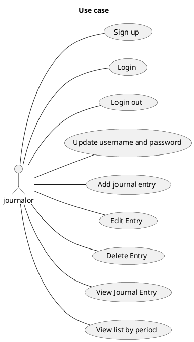

```plantuml
@startuml

title Use case

actor "journalor" as journalor

usecase "Sign up" as s
usecase "Login" as l
usecase "Login out" as lo
usecase "Update username and password" as up
usecase "Add journal entry" as add 
usecase "Edit Entry" as edit
usecase "Delete Entry" as delete
usecase "View Journal Entry" as view
usecase "View list by period" as period
left to right direction

journalor -- s
journalor -- lo
journalor -- l
journalor -- add
journalor -- edit
journalor -- delete
journalor -- view
journalor -- period
journalor -- up
@endum
```